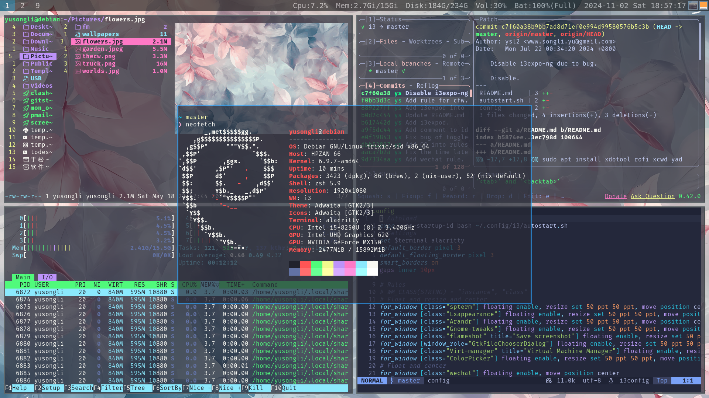

#  i3



Build i3 and i3blocks from official source repo.

Also:

```bash
pip install autotiling
picom (build from official source repo)
sudo apt install feh
```

`config_bak` and `i3blocs.bak.conf` are the official config files, just for backup.
